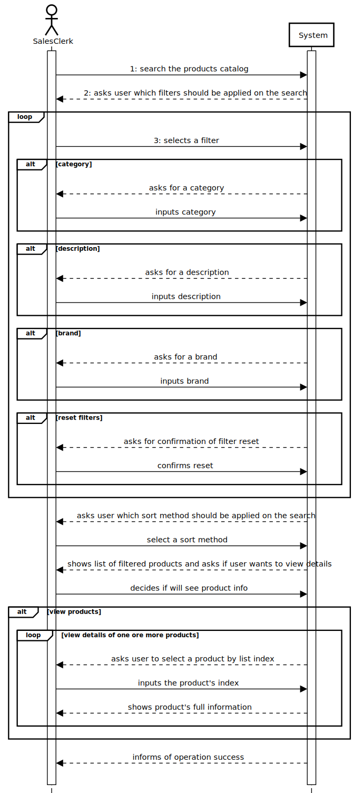
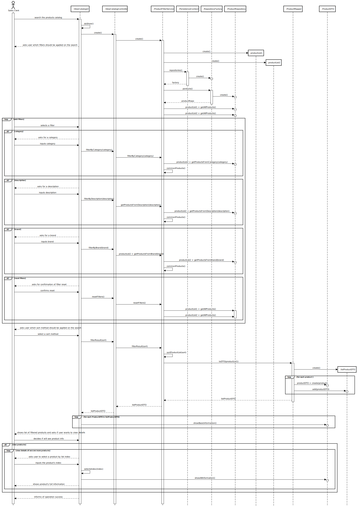
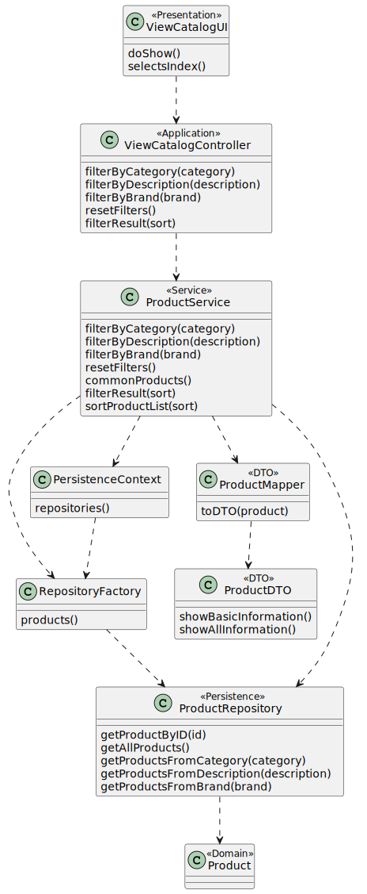

# US1002: View/Search the product catalog
=======================================

# 1. Requirements

**US1002**: As Sales Clerk, I want to view/search the products catalog.

### Client clarifications 

* Products can be filtered by category, descriptions or brand.
* Product's code, short description, brand, category and unit price should be presented.

# 2. Analysis

# 1.Actor #
* Sales Clerk.

# 2.Acceptance Criteria #
* No acceptance criterias were given on the user story's description.

# 3.Relevant business aspects
* Products can have three distinct descriptions: short, extended and technical.
* It should be possible to choose multiple filters and also reset them.

# 3. Design

## 3.1. Realização da Funcionalidade

## 3.2. Diagrama de Classes

## 3.3. Padrões Aplicados

*Pure Fabrication
*Controller
*Facade
*DTO
*Factory Method
*Information Expert
*Abstract Factory
*Repository

