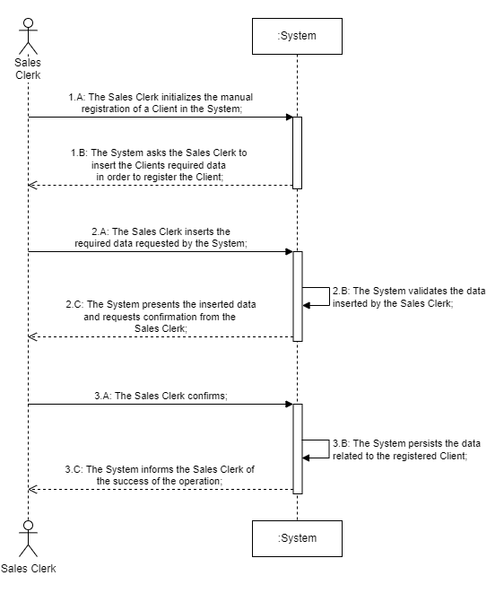
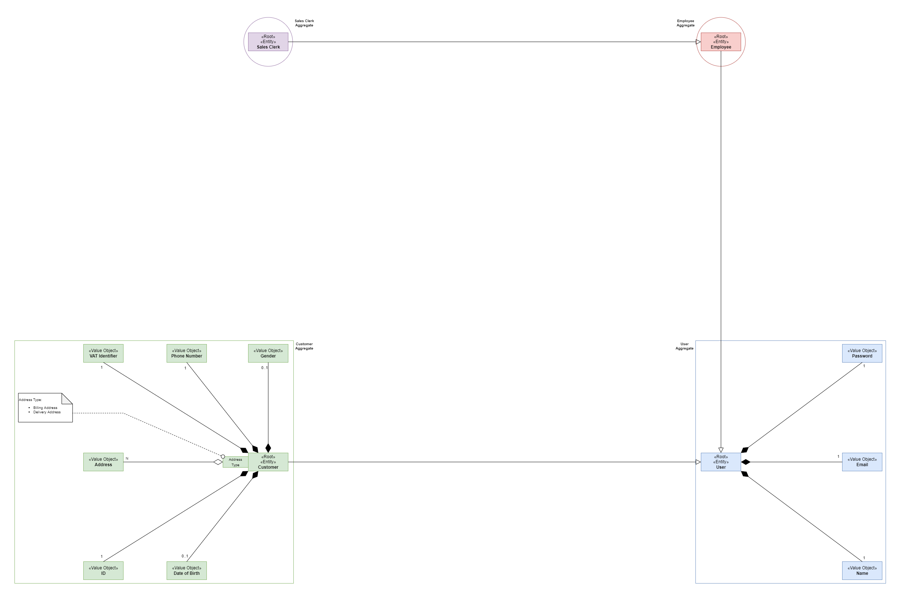
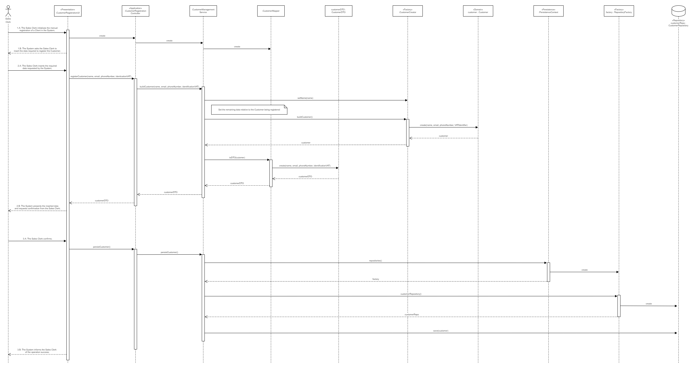
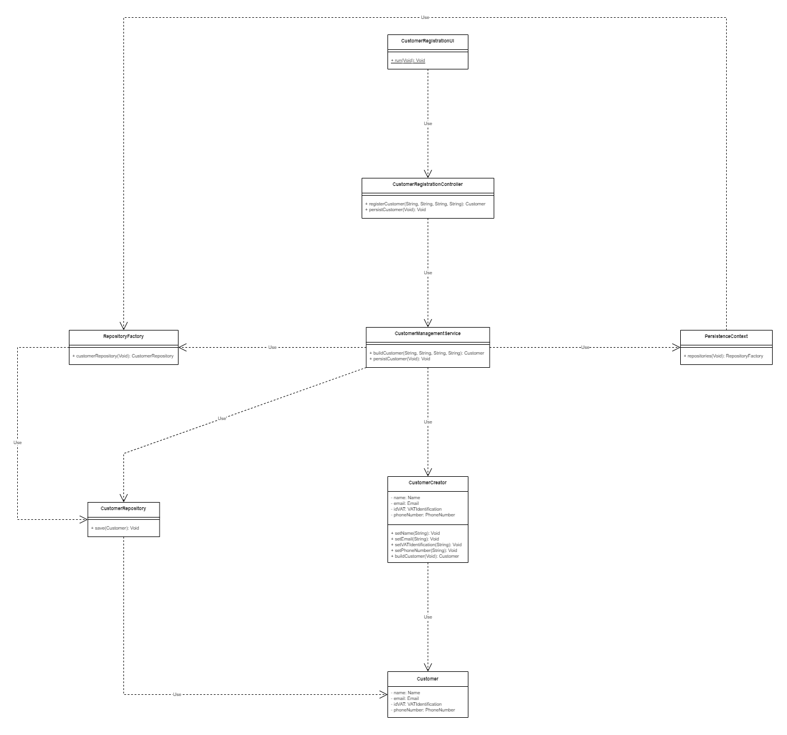

## <b>UC 3.1.4b - Manual Registration of a Client in the System</b>
 

### <b>1. Requirements Engineering</b>
 

#### <b>1.A. Brief Format</b>
 

The Sales Clerk initializes the manual registration of a Client in the System.

The System asks the Sales Clerk to insert the Client's required data in order to register Client.

The Sales Clerk inserts the required data previously requested by the System. The System proceeds to validate the data inserted by the Sales Clerk.

The System presents the inserted data and asks confirmation from the Sales Clerk;

The Sales Clerk confirms;

The System persists the data related to the registered Client. The System informs the Sales Clerk that the Client was successfully registered.

 

#### <b>1.B. SSD</b>

 

 
 

#### <b>1.C. Complete Format</b>
 

<b>Main Actor</b>

&ensp;&ensp;&ensp;&ensp;Sales Clerk

 

<b>Interested Actors and their respective interests</b>

&ensp;&ensp;&ensp;&ensp;<b>Sales Clerk:</b> intends to register a Client in the System;

&ensp;&ensp;&ensp;&ensp;<b>SPOMS:</b> intends to have Clients registered, in order to be utilized by said Clients;

&ensp;&ensp;&ensp;&ensp;<b>Client:</b> intends to be registered in order to use and benefit from the services provided by the System;

 

<b>Preconditions</b>

&ensp;&ensp;&ensp;&ensp;It is required that at least a single Sales Clerk be registered in the System;

 

<b>Postconditions</b>

&ensp;&ensp;&ensp;&ensp;The data inserted related to the Client is registered and persisted in the System;

 

<b>Main Scenario</b>
<ol>
    <li>&ensp;The Sales Clerk initializes the manual registration of a Client in the System;</li>
    <li>&ensp;The System requests that the Sales Clerk inserts the Clients data (i.e. the Client's name, their Value-Added Tax identifier, their email address and their phone number);</li>
    <li>&ensp;The Sales Clerk inserts the solicited data;</li>
    <li>&ensp;The System validates, presents the inserted data and requests confirmation from the Sales Clerk;</li>
    <li>&ensp;The Sales Clerk confirms;</li>
    <li>&ensp;The System persists the data related to the newly registered Client and informs the Sales Clerk of the operation success;
</ol>
 

<b>Alternative Scenarios</b>

&ensp;&ensp;&ensp;&ensp;*a. The Sales Clerk cancels the registration process of the Client;

> 
&ensp;&ensp;&ensp;&ensp;&ensp;&ensp;&ensp;&ensp;The Use Case terminates;

 

&ensp;&ensp;&ensp;&ensp;3.a. The Sales Clerk also inserts non essential data relate to the Client (i.e. the Client's date of birth, their gender and several billing and delivery addresses);

> 
&ensp;&ensp;&ensp;&ensp;&ensp;&ensp;&ensp;&ensp;The System accepts the non essential data inserted by the Sales Clerk (step #3);

 

&ensp;&ensp;&ensp;&ensp;4.a. The System detects that data or a set of essential data wasn't inserted by the Sales Clerk;

> 
&ensp;&ensp;&ensp;&ensp;&ensp;&ensp;&ensp;&ensp;1. The System notifies the Sales Clerk of the previously mentioned situation;

> 
&ensp;&ensp;&ensp;&ensp;&ensp;&ensp;&ensp;&ensp;2. The System allows the Sales Clerk insert the missing required data (step #3);

>
&ensp;&ensp;&ensp;&ensp;&ensp;&ensp;&ensp;&ensp;&ensp;&ensp;&ensp;&ensp;&ensp;&ensp;2.a. The Sales Clerk doesn't insert the requested missing data;

>
&ensp;&ensp;&ensp;&ensp;&ensp;&ensp;&ensp;&ensp;&ensp;&ensp;&ensp;&ensp;&ensp;&ensp;2.b. The Use Case terminates;

 

&ensp;&ensp;&ensp;&ensp;4.b. The System detects that data, or a subset of the inserted data are already persisted in the System;

> 
&ensp;&ensp;&ensp;&ensp;&ensp;&ensp;&ensp;&ensp;1. The System notifies the Sales Clerk of the previously mentioned situation;

> 
&ensp;&ensp;&ensp;&ensp;&ensp;&ensp;&ensp;&ensp;2. The System allows the Sales Clerk insert the missing required data (step #3);

>
&ensp;&ensp;&ensp;&ensp;&ensp;&ensp;&ensp;&ensp;&ensp;&ensp;&ensp;&ensp;&ensp;&ensp;2.a. The Sales Clerk doesn't insert the requested missing data;

>
&ensp;&ensp;&ensp;&ensp;&ensp;&ensp;&ensp;&ensp;&ensp;&ensp;&ensp;&ensp;&ensp;&ensp;2.b. The Use Case terminates;

 

<b>Special Requirements</b>

&ensp;&ensp;&ensp;&ensp;N/A

 

<b>List of Variations of Technology and Data</b>

&ensp;&ensp;&ensp;&ensp;N/A

 

<b>Frequency of Occurence</b>

&ensp;&ensp;&ensp;&ensp;N/A

 

### <b>2. Analysis</b>
 

<b>Excerpt of the Domain Model relative to the Use Case</b>
 

 
 

### <b>3. Design</b>
 

#### <b>3.A. Rationale</b>
 

| Main Scenario | Question: Which class... | Answer | Pattern - Justification |
|:--------------|:-------------------------|:-------|:--------------|
| 1.&ensp;&ensp;The Sales Clerk initializes the manual registration of a Client in the System; | Interacts with the Sales Clerk? | CustomerRegistrationUI | Pure Fabrication - Class that doesn't represent a concept captured in the Domain Model but is necessary to achieve low coupling and high cohesion; |
| | Coordinates the Use Case? | CustomerRegistrationController | Controller - Class responsible for receiving or handling System events; |
| | Manages communication between the Application Layer and the Domain Layer? | CustomerManagementService | Facade - Interface that hides the complexities of the System; |
| | Transfers data between the Application Layer abd the Domain Layer? | 
CustomerMapper

CustomerDTO
 | DTO - Class that transfers data between processes providing also an extra layer of encapsulation; |
| | Creates Customer instances? | CustomerCreator | Factory Method - Interface that allows the creation of an instance of a given Superclass, but also permits its Subclasses to alter the Type of the Objects to be created; |
| 2.&ensp;&ensp;The System requests that the Sales Clerk inserts the Clients data (i.e. the Client's name, their Value-Added Tax identifier, their email address and their phone number); 
| 3.&ensp;&ensp;The Sales Clerk inserts the solicited data; | Stores the data inserted? | Customer | I.E. (Information Expert) - Class that has the information necessary to fulfill the responsibility. |
| 4.&ensp;&ensp;The System validates, presents the inserted data and requests confirmation from the Sales Clerk; | Is responsible for local validation? | Customer | I.E. (Information Expert) - Class that has the information necessary to fulfill the responsibility. |
| | Is responsible for global validation? | CustomerRepository | Repository - Abstraction of the Data Layer which centralises the handling of the Domain Objects; |
| 5.&ensp;&ensp;The Sales Clerk confirms; |
| 6.&ensp;&ensp;The System persists the data related to the newly registered Client and informs the Sales Clerk of the operation success; | Creates instance responsible for the persistence of Customer instances? | RepositoryFactory | Abstract Factory - Interface responsible for creating a Factory of related Objects without explicitly specifying the intend Class; |
| | Persists the Customer instance created? | CustomerRepository | Repository - Abstraction of the Data Layer which centralises the handling of the Domain Objects; |
 

#### <b>3.B. Systematization</b>
 

From the Rationale, the following Conceptual Classes are promoted to Software Classes:

<ul>
    <li>Customer;</li>
</ul>
 

Other Software Classes identified:

<ul>
    <li>CustomerRegistrationUI;</li>
    <li>CustomerRegistrationController;</li>
    <li>CustomerManagementService;</li>
    <li>CustomerMapper</li>
    <li>CustomerDTO</li>
    <li>CustomerCreator;</li>
    <li>PersistenceContext;</li>
    <li>RepositoryFactory;</li>
    <li>CustomerRepository;</li>
</ul>
 

#### <b>3.C. Sequence Diagram</b>
 

 
 

#### <b>3.D. Class Diagram</b>
 

 
 

### <b>4. Implementation</b>
 

TODO

 

