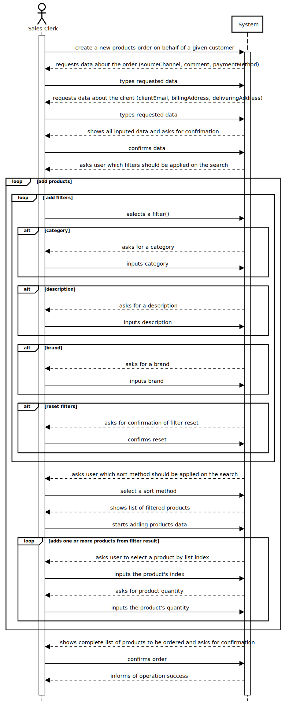
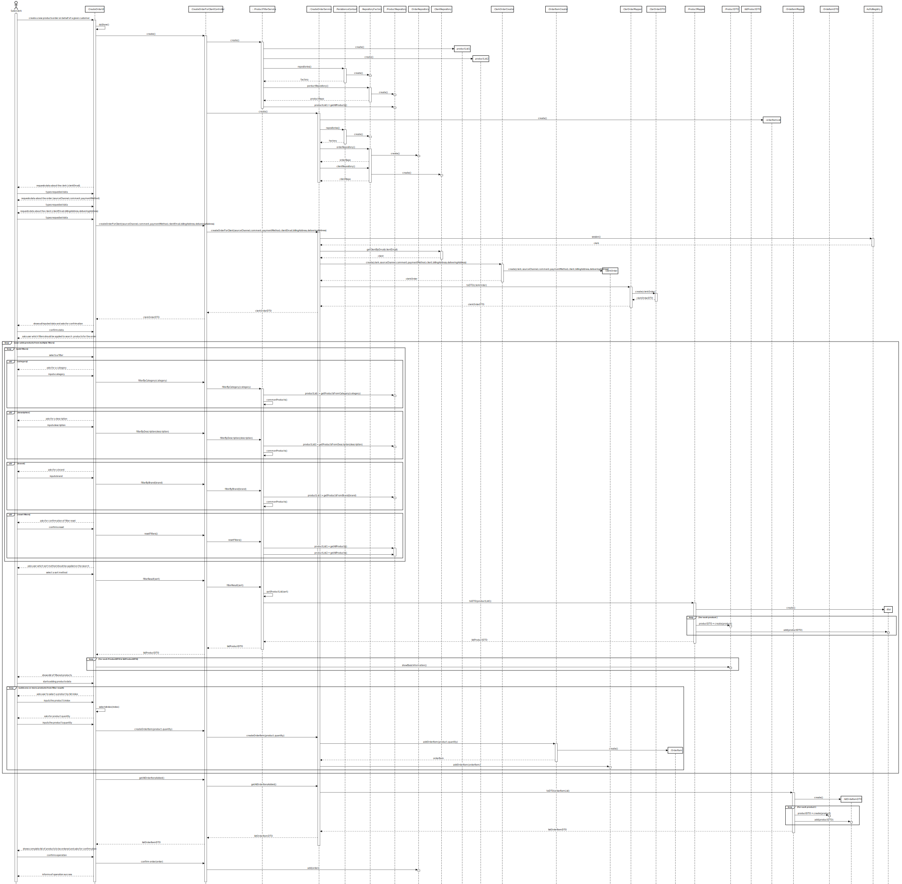
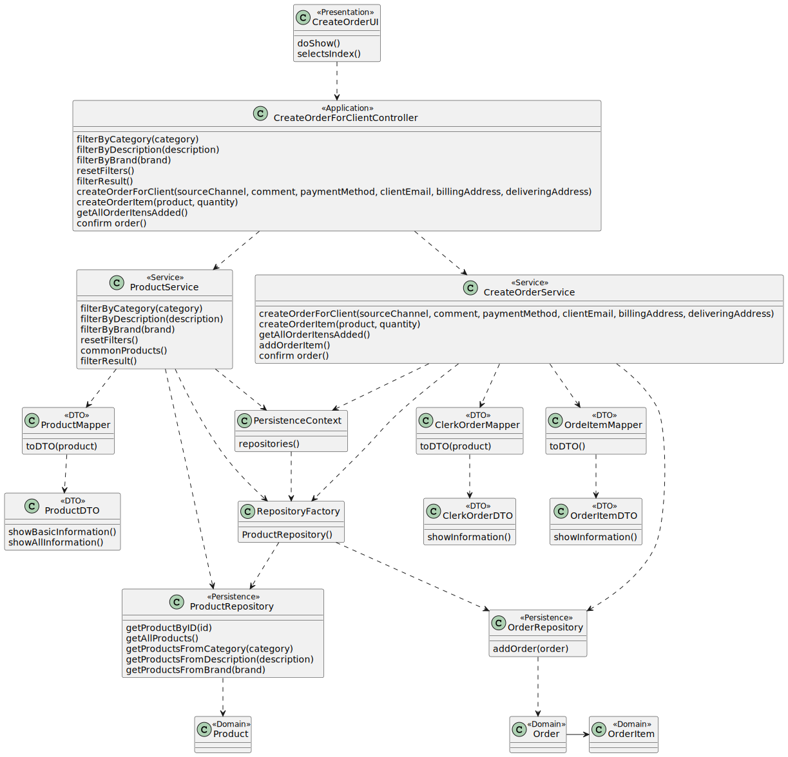

# US1004: Create a new products order on behalf of a given customer
=======================================

# 1. Requirements

**US1004**: As Sales Clerk, I want to create a new products order on behalf of a given customer.

### Client clarifications 

* "Despite identifying the clerk registering the order, it is important to register (i) the source channel 
(e.g.: phone, email, meeting, etc...), (ii) the date/time when such interaction happen and (iii) optionally add some comment".
* "Both: by typing the product id when knowing it or by using searching/browsing the products catalog (US1002)."

# 2. Analysis

# 1.Actor #
* Sales Clerk.

# 2.Acceptance Criteria #
* No acceptance criterias were given on the user story's description.

# 3.Relevant business aspects
* Orders contain multiple items, added using us 1002 's filtering service
* The clerk must be obtained from the session
* The shopping cart is not used during this process.

# 3. Design

## 3.1. Realização da Funcionalidade

## 3.2. Diagrama de Classes

## 3.3. Padrões Aplicados

*Pure Fabrication
*Controller
*Facade
*DTO
*Factory Method
*Information Expert
*Abstract Factory
*Repository