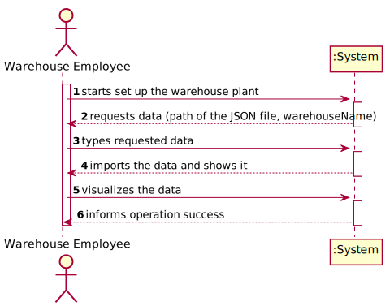
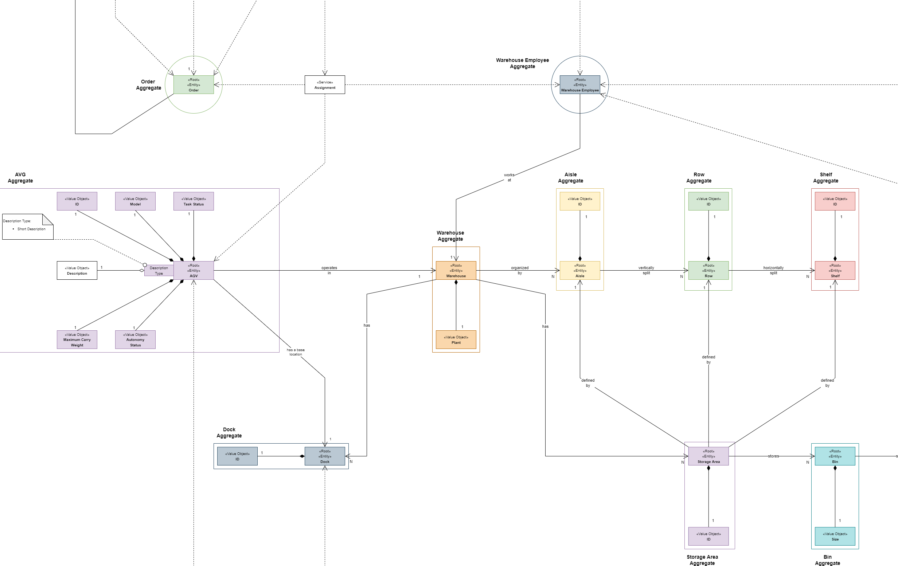
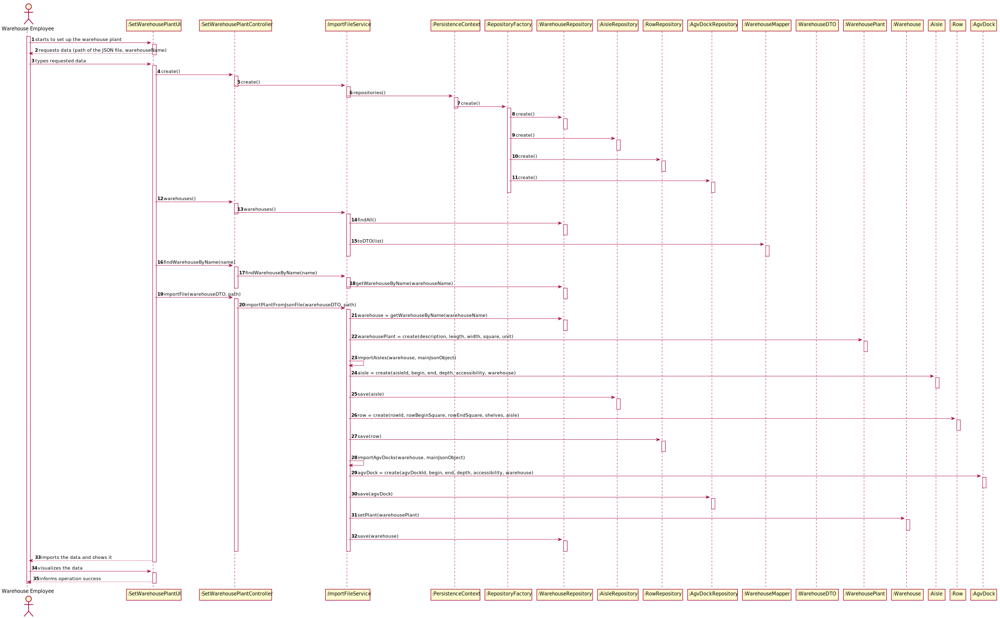
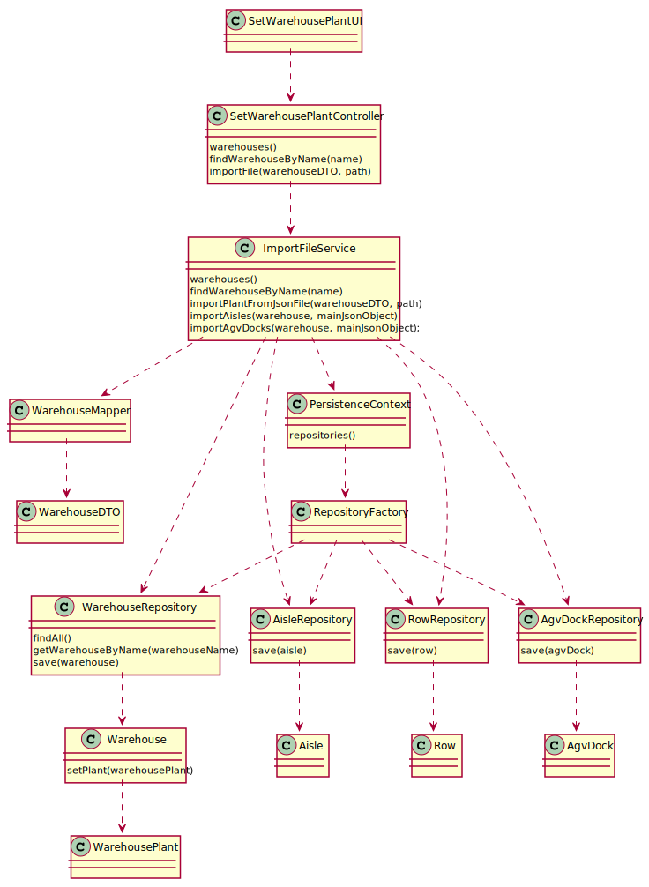

# US2001 - Set up a warehouse plant
=======================================

# 1. Requirements

### User Story Description
* As Warehouse Employee, I want to set up the warehouse plant by uploading a JSON file.

### Client clarifications 

> **Question:** Does a warehouse always have the same plant or can it have different plants in the future?
>
> [**Answer:**](https://moodle.isep.ipp.pt/mod/forum/discuss.php?d=15725#p20208) Each warehouse has its own plant and,
> therefore, plants might vary from one warehouse to another. However, any warehouse plant is described by a JSON file
> according to the data structure described in section 5.2 of the specifications' document. On US2001, any JSON file
> meeting such data structure must be supported.

-

> **Question:** Regarding the shelves in each row that are part of an aisle, is there a need to differentiate them?
> If not, how will the AGV know on which shelf to look for a product? Because, as we understood, different products can
> be placed on a different shelf of the same row, and according to the JSON file provided, each row only states how many
> shelves it has.
>
> [**Answer:**](https://moodle.isep.ipp.pt/mod/forum/discuss.php?d=15758#p20252) Yes! You need to differentiate the
> shelves in each row of an aisle. Recall that "The products’ location in the warehouse, which corresponds to a storage
> area i.e., the aisle identifier, the row identifier, and the shelf identifier. All these identifiers are numeric.
> "As you have noticed, each row states how many shelves it has. As so, if a row states it has 4 shelves, it means that
> the row shelves are identified as shelf 1, 2, 3 and 4 from the bottom to the top. If another row stated it has 3
> shelves, it means that such row shelves are identified as shelf 1, 2 and 3 again from the bottom to the top.

-

> **Question:** Regarding the upload of a JSON file, is that file supposed to be stored with the rest of the
> application and be uploaded every time the application runs or should the upload be done only once where the
> information would all be uploaded to the application database and the JSON file discarded/not stored?
>
> [**Answer:**](https://moodle.isep.ipp.pt/mod/forum/discuss.php?d=15781#p20282) The purpose of uploading a JSON file (US2001)
> is to set up the warehouse plant information required to the system work properly. Once that information is set up,
> there is no need to repeat the set up process. As so, if a JSON file is found the user might be prompt if (s)he wants
> to update the information about the warehouse plant. The user might also update the information by re-executing the US2001.
>
> Yet, it is worth noticing that the JSON file might not be available on all workstations used by warehouse employees.
> As so, persisting warehouse plant data on the database seems to be a good option.

### 1.6. System Sequence Diagram (SSD)

# 2. Analysis

### Relevant Domain Model Excerpt

# 3. Design

## 3.1. Functionality realization

### Sequence Diagram

## 3.2. Class Diagram

## 3.3. Applied Patterns

* Controller
* Creator
* Repository
* Factory
* Persistence Context
* DTO

## 3.4. Tests 
*Nesta secção deve sistematizar como os testes foram concebidos para permitir uma correta aferição da satisfação dos requisitos.*

**Teste 1:** Verificar que não é possível criar uma instância da classe Exemplo com valores nulos.

	@Test(expected = IllegalArgumentException.class)
		public void ensureNullIsNotAllowed() {
		Exemplo instance = new Exemplo(null, null);
	}

# 4. Implementação

*Nesta secção a equipa deve providenciar, se necessário, algumas evidências de que a implementação está em conformidade com o design efetuado. Para além disso, deve mencionar/descrever a existência de outros ficheiros (e.g. de configuração) relevantes e destacar commits relevantes;*

*Recomenda-se que organize este conteúdo por subsecções.*

# 5. Integração/Demonstração

*Nesta secção a equipa deve descrever os esforços realizados no sentido de integrar a funcionalidade desenvolvida com as restantes funcionalidades do sistema.*

# 6. Observações

*Nesta secção sugere-se que a equipa apresente uma perspetiva critica sobre o trabalho desenvolvido apontando, por exemplo, outras alternativas e ou trabalhos futuros relacionados.*

