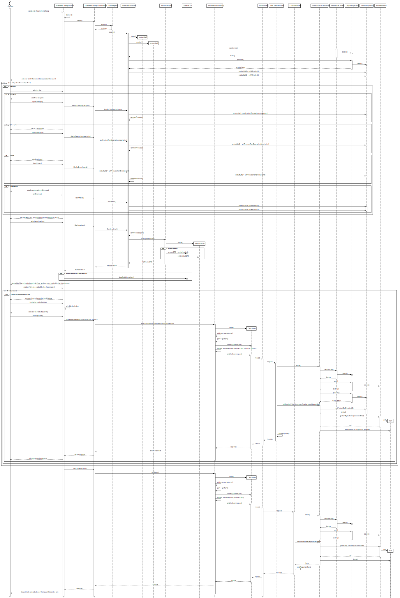

# US1501: View/search the product catalog and be able to add a product to the shopping cart.
=======================================

# 1. Requirements

**US1501**: As Customer, I want to view/search the product catalog and be able to add a product to the shopping cart.
### Client clarifications 
-None given

# 2. Analysis

# 1.Actor #
* Customer.

# 2.Acceptance Criteria #
* It is mandatory using the "OrdersServer" component (cf. US1901).

# 3.Relevant business aspects
* It should be possible to choose multiple filters and also reset them.
* The shopping cart content should be preserved from one customer session to another

# 3. Design

## 3.1. System Diagram

