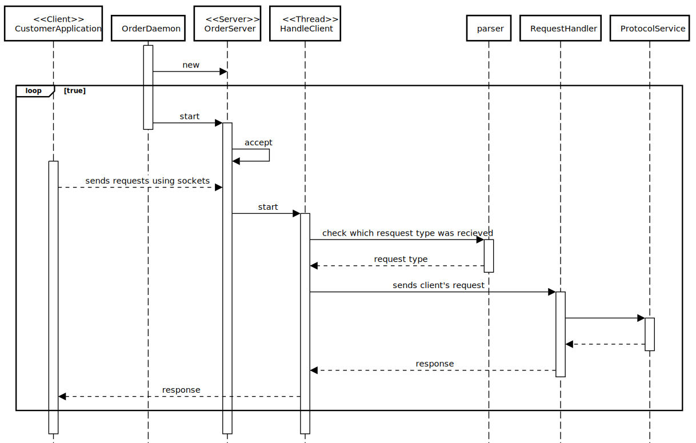

# US1901: OrdersServer component supports properly, at request, the needs of the CustomerApp application.
=======================================

# 1. Requirements

**US1901**: As Project Manager, I want that the "OrdersServer" component supports properly, at request, the needs of the "CustomerApp" application.

### Client clarifications 
-None given

# 2. Analysis

# 1.Actor #
* Project Manager.

# 2.Acceptance Criteria #
* It must be used the provided application protocol (SPOMS2022).
* It is suggested the adoptiong of concurrent mechanisms (e.g. threads) and state sharing between these mechanisms.
* In this sprint, for demonstration purposes, it is acceptable to mock processing some of the incoming requests.

# 3.Relevant business aspects
* The set of available/possible requests must be minimized and, each one, should have a very specific purpose.
* Server Information

     | Server IP  | Server Port |
     |:---------- |:----------- |
     |  	-	|      -  	  |

# 3. Design

## 3.1. System Diagram

