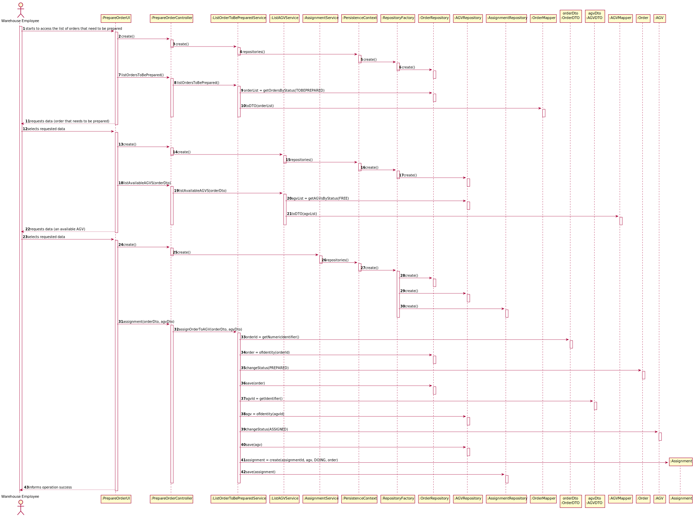

# US2003 - Access the list of orders that need to be prepared by an AGV 
=======================================

# 1. Requirements

### User Story Description

* As Warehouse Employee, I want to access the list of orders that need to be prepared by an AGV and be able to ask/force 
any of those orders to be immediately prepared by an AGV available.

### From the specifications document

"Another relevant aspect the system needs to track properly concerns the several states that every
order goes by since it is registered in the system to the moment it is received by the customers. Some
possible states that can be considered are: (i) registered, (ii) payment pending, (iii) to be prepared
(waiting for an initial warehouse action), (iv) being prepared on the warehouse, (v) ready for
packaging; (vi) ready for carrier dispatching, (vii) dispatched, (viii) delivered by carrier, (ix) received by
customer. Notice that all relevant states might not be listed and some of the listed states might be
redundant and/or not necessary by some reason. As so, this matter should be carefully analyzed."

### Client clarifications 

> **Question:** Regarding US2003, the development team was wondering if the warehouse 
> employee chooses the intended AGV available to prepare the specific order or if 
> it should be assigned to any AGV available without even asking the warehouse 
> employee.
>
> [**Answer:**](https://moodle.isep.ipp.pt/mod/forum/discuss.php?d=16270#p20884) In the 
> scope of US 2003, the AGV is selected by the warehouse employee from the ones that are 
> available and are able to perform the task.

-

> **Question:** It is mentioned that the warehouse is able to force a certain task to 
> a certain AGV, but can this only happen when the AGV is free, or can the warehouse 
> employee cancel a task and assign a new one.
>
> [**Answer:**](https://moodle.isep.ipp.pt/mod/forum/discuss.php?d=16277#p20891) In the 
> scope of US 2003, the AGV is selected by the warehouse employee from the ones that are 
> available and are able to perform the task. Tasks cannot be manually cancelled.

-

> **Question:** Regarding this feature, what would you consider to be its complete state, 
> that is, what would be the criterion to define whether or not this feature was functional?
>
> [**Answer:**](https://moodle.isep.ipp.pt/mod/forum/discuss.php?d=16290#p20907)
The warehouse employee is able to (i) select an order that needs to be prepared; 
> (ii): select the AGV from the ones that are available and able to perform the task; 
> (iii) the task is sent to the selected AGV and (iv) the order change its status.

-

> **Question:** Knowing that in US2003 it is only mentioned that the Warehouse Employee 
> will do this action, I would like to know if it is part of the System to allow users 
> with greater skills and responsibilities (Warehouse Managers or Admins) to also perform 
> the same task? If yes, which users?
>
> [**Answer:**](https://moodle.isep.ipp.pt/mod/forum/discuss.php?d=16291#p20908) No! There is not such need.

-

> **Question:** What would be the minimum information needed to show the User in order to 
> select the desired Order? From our meeting the minimum result was the Identification, 
> total Weight and Total Volume. Should we add something else?
>
> [**Answer:**](https://moodle.isep.ipp.pt/mod/forum/discuss.php?d=16480#p21147) I would say that from the 
> warehouse employee point of view, it is useful to show the order id, the order date, the customer id/name 
> and order total. The total weight and total volume might be also useful if (s)he knows the AGV' 
> characteristics. However, it is up to the system ensure that the selected AGV is capable of fulfilling 
> the task.

-

> **Question:** In US4002 it is required that the AGV Manager should support automatic assignment of orders to AGVs. 
> In US2003 the Warehouse Employee will be able to assign any order to an AGV available. If the orders are being 
> automatically assigned to an AGV (US4002) how can the Warehouse Employee assign a specific order to an AGV?
>
> [**Answer:**](https://moodle.isep.ipp.pt/mod/forum/discuss.php?d=16394#p21052) Usually, and by default, one intends 
> that system automatically assigns orders to AGVs (US 4002). However, if such option is not available 
> (e.g.: turned off) or by some reason an order needs to be prepared faster than it would normally be, the warehouse 
> employee has the ability to assign tasks manually (US 2003). Notice that, orders that can be prepared by AGVs are 
> being added to a queue following a FIFO algorithm (part of the US 4002). In the scope of US 2003 the FIFO algorithm 
> does not apply... the employee might choose the order (s)he wants.

### Actor 
*  Warehouse Employee

### Acceptance Criteria 
* No acceptance criteria was given on the User Story's description.

# 2. Analysis

1. The warehouse employee must select an order to be prepared.
2. Selects which AGV is going to perform the task from the ones that are available.
3. The selected AGV stays in charge of that order.
4. The order and the AGV status are updated.

# 3. Design

## Sequence Diagram

