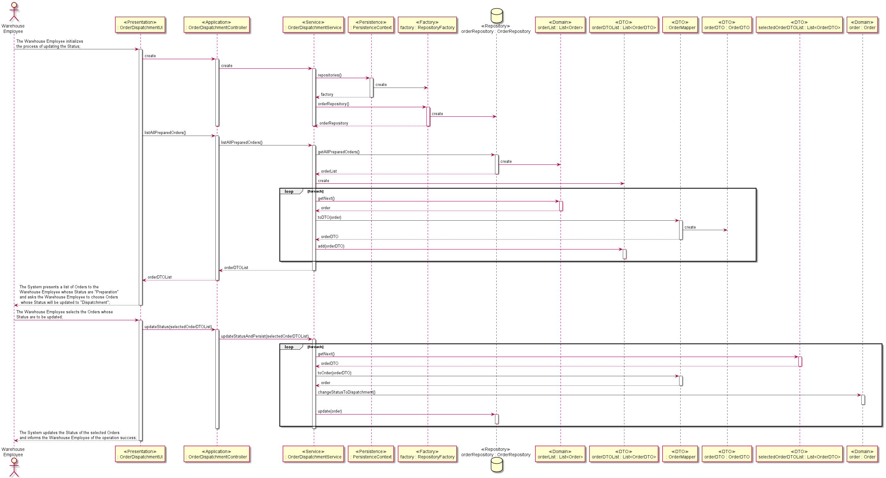

## <b>US 2004 - Update Order Status after preparation by the AGV</b>
 

### <b>1. Requirements Engineering</b>
 

#### <b>1.A. Complete Format</b>
 

<b>Main Actor</b>

&ensp;&ensp;&ensp;&ensp;Warehouse Employee

 

<b>Interested Actors and their respective interests</b>

&ensp;&ensp;&ensp;&ensp;<b>Warehouse Employee:</b> intends to update the status of any Order already prepared by any AGV.

&ensp;&ensp;&ensp;&ensp;<b>SPOMS:</b> intends to have the prepared Orders dispatched in order to be delivered to their respective Customers.

&ensp;&ensp;&ensp;&ensp;<b>Customer:</b> intends to receive their placed Order, thus requires that said Order be dispatched.

 

<b>Preconditions</b>

&ensp;&ensp;&ensp;&ensp;It is required that at least a single Order be placed and its Status be "Preparation".

 

<b>Postconditions</b>

&ensp;&ensp;&ensp;&ensp;The Status of the selected Orders should be update to "Dispatchment".

 

<b>Main Scenario</b>
<ol>
    <li>The Warehouse Employee initializes the process of updating the Status;</li>
    <li>The System presents a list of Orders to the Warehouse Employee whose Status are "Preparation"</li>
    <li>The System asks the Warehouse Employee to choose Orders whose Status will be updated to "Dispatchment";</li>
    <li>The Warehouse Employee selects the Orders whose Status are to be updated;</li>
    <li>The System updates the Status of the selected Orders and informs the Warehouse Employee of the operation success;</li>
</ol>
 

<b>Alternative Scenarios</b>

&ensp;&ensp;&ensp;&ensp;*a. The Warehouse Employee cancels the process of updating the Status of Orders whose status is "Preparation";

> 
&ensp;&ensp;&ensp;&ensp;&ensp;&ensp;&ensp;&ensp;The Use Case terminates;

 

&ensp;&ensp;&ensp;&ensp;4.a. The Warehouse Employee doesn't select any Order to have its Status updated;

> 
&ensp;&ensp;&ensp;&ensp;&ensp;&ensp;&ensp;&ensp;1. The System notifies the Warehouse Employee of the previously mentioned situation;

> 
&ensp;&ensp;&ensp;&ensp;&ensp;&ensp;&ensp;&ensp;2. The System allows the Warehouse Employee to select Orders whose Status will be updated (step #3);

>
&ensp;&ensp;&ensp;&ensp;&ensp;&ensp;&ensp;&ensp;&ensp;&ensp;&ensp;&ensp;&ensp;&ensp;2.a. The Warehouse Employee doesn't select any Order to have its Status updated;

>
&ensp;&ensp;&ensp;&ensp;&ensp;&ensp;&ensp;&ensp;&ensp;&ensp;&ensp;&ensp;&ensp;&ensp;2.b. The Use Case terminates;

 

<b>Special Requirements</b>

&ensp;&ensp;&ensp;&ensp;N/A

 

<b>List of Variations of Technology and Data</b>

&ensp;&ensp;&ensp;&ensp;N/A

 

<b>Frequency of Occurence</b>

&ensp;&ensp;&ensp;&ensp;N/A

 

### <b>2. Design</b>
 

#### <b>3.A. Rationale</b>
 

| Main Scenario | Question: Which class... | 
Answer
 | Pattern - Justification |
|:--------------:|:-------------------------:|:-------:|:--------------:|
| 1.&ensp;&ensp;The Warehouse Employee initializes the process of updating the Status; |  
A. Interacts with the Warehouse Employee?

B. Coordinates the Use Case?

C. Interacts with the Domain Layer?
 | 
A. OrderDispatchmentUI

B. OrderDispatchmentController

C. OrderDispatchmentService
 | 
A. Pure Fabrication - Class that doesn't represent a concept captured in the Domain Model but is necessary to achieve low coupling and high cohesion;

B. Controller - Class responsible for receiving or handling System events;

C. Controller-Service - Class responsible for processing business logic;
 |
| 2.&ensp;&ensp;The System presents a list of Orders to the Warehouse Employee whose Status are "Preparation" | 
A. Knows the Status associated to an instance of Order?

B. Retrieves the list of Orders?

C. Creates an instance of OrderRepository?

D. Manages instance of RepositoryFactory?

E. Contains data related to an instance of Order and is useable by the Application and Domain Layer?

F. Converts an instance of Order to an instance of OrderDTO?
 | 
A. Order

B. OrderRepository

C. RepositoryFactory

D. PersistenceContext

E. OrderDTO

F. OrderMapper
 | 
A. Information Expert  - Class that has the information necessary to fulfill the responsibility;

B. Repository - Abstraction of the Data Layer which centralises the handling of the Domain Objects;

C. Abstract Factory - Interface responsible for creating a Factory of related Objects without explicitly specifying the intend Class;

D. Information Expert  - Class that has the information necessary to fulfill the responsibility;

E. DTO - Class that encapsulates and aggregates for transfer;

F. DTO - Class responsible of mapping data from Domain Entities to DTOs;
 |
| 3.&ensp;&ensp;The System asks the Warehouse Employee to choose Orders whose Status will be updated to "Dispatchment"; | | | |
| 4.&ensp;&ensp;The Warehouse Employee selects the Orders whose Status are to be updated; | | | |
| 5.&ensp;&ensp;The System updates the Status of the selected Orders; | 
A. Updates the Status of the Order instance?

B. Updates in the database the Order instance in question?
 | 
A. Order

B. OrderRepository
 | 
A. Information Expert  - Class that has the information necessary to fulfill the responsibility;

B. Repository - Abstraction of the Data Layer which centralises the handling of the Domain Objects;
 |
 

#### <b>2.B. Systematization</b>
 

From the Rationale, the following Conceptual Classes are promoted to Software Classes:

<ul>
    <li>Order;</li>
</ul>
 

Other Software Classes identified:

<ul>
    <li>OrderDispatchmentUI;</li>
    <li>OrderDispatchmentController;</li>
    <li>OrderDispatchmentService;</li>
    <li>PersistenceContext;</li>
    <li>RepositoryFactory;</li>
    <li>OrderRepository;</li>
    <li>OrderMapper;</li>
    <li>OrderDTO;</li>
</ul>
 

#### <b>2.C. Sequence Diagram</b>
 

 
 

#### <b>2.D. Test Planning</b>
 

This section contains primary Unit Tests developped in order to affer the satisfaction of the User Stories requisites;

 

| Tested Class | Test Objective | 
Implementation
 |
|:--------------|:-------------------------|:------------------------|
| Order | Verify that the method "changeStatusToDispatchment()" changes the current Status associated to an Order instance to the Status "Dispatchment"; | 
@Test public void ensureOrderStatusIsChangedToDispacthment() { &ensp;&ensp;Status expRes = new Status("Dispatchment");  &ensp;&ensp;order.changeStatusToDispatchment(); &ensp;&ensp;assertEquals(expRes, order.currentStatus()); }
 |
| OrderDispatchmentService | Verify that the method "listAllPreparedOrders()" returns solely Orders whose Status are "Preparation"; | 
@Test public void ensureListOnlyContainsPreparedOrders()  { &ensp;&ensp;for (Order order : service.listAllPreparedOrders()) &ensp;&ensp;&ensp;&ensp;assertTrue(!order.currentStatus().equals(new Status("Preparation"))); } |
|