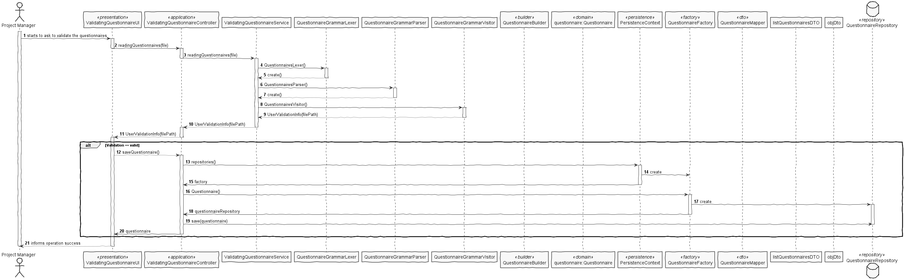

User Story 3001: Create a new questionnaire
==================================================

# 1.User Story description #
* As Sales Manager, I want to create a new questionnaire to be further answered by customers
meeting the specified criteria

# 2.Actor #
* Sales Manager.

# 3.Acceptance Criteria #
* The set of questions/answers composing the questionnaire should be expressed and validated
(parsed) using the grammar being developed for this purpose.

# 4. Client clarifications #

Q: 

Dear client, 

The User Story 3001  refers to the UC 3.3.1 -> "Create a new survey. A survey is characterized by an alphanumeric code, a description, the period( in days) it will be performed, the intended questionnaire, and a set of rules that allows the system to determine the survey target audience."

But what are the constraints to the survey alphanumeric code and the description? 

A:

Basic constraints:

- Code: alphanumeric value with 15 chars max;

- Description: non-empty short sentence (e.g.: 40 chars).

Q:

Dear client,

As I understand, the questionnaire will have to be created through the command-line interface of our application and then exported in order for it's grammar to be validated.

Is my interpretation correct?

Can we export it to XML, for example, and validate it's grammar afterwards?

Thanks.

A:

There is no need to import/export data.

Both components should be integrated.

I advice you to talk with technical experts (faculty of Lab classes of course units).

Q:

Dear Client,

I have some doubts about the questionnaires.

The same section can be present in more than one questionnaire?
The same question can be present in more than one section?
Best Regards,

1201188 2DD_G01

A:

Yes, that can happen.

However, there is no intend to reutilize questions and/or sections. If that happens, the user will type the question/section again.

# 5.Relevant business aspects 
* 

# 6. Design

## 6.1. System Diagram

