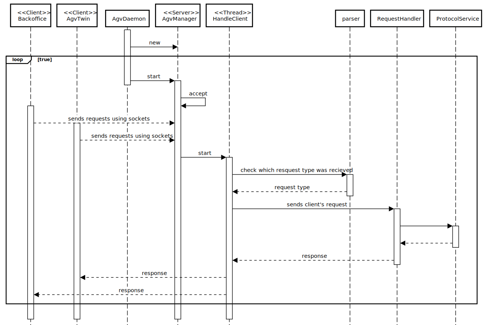

# US4001: OrdersServer component supports properly, at request, the needs of the CustomerApp application.
=======================================

# 1. Requirements

**US4001**: As Project Manager, I want that the "AGVManager" component supports properly, at request, the needs of the "BackOfficeApp" application as well as the needs the AGV digital twin.
-None given

# 2. Analysis

# 1.Actor #
* Project Manager.

# 2.Acceptance Criteria #
* It must be used the provided application protocol (SPOMS2022).
* It is suggested the adoptiong of concurrent mechanisms (e.g. threads) and state sharing between these mechanisms.

# 3.Relevant business aspects
* responsible for managing and interacting with all the AGVs operating on the warehouse.
* assign tasks to a given AGV through the “CMD API”.
* receive from AGVs data to update their status on the system through the “Status API”.
* Server Information

     | Server IP  | Server Port |
     |:---------- |:----------- |
     |  	-	|      -  	  |

# 3. Design

## 3.1. System Diagram

