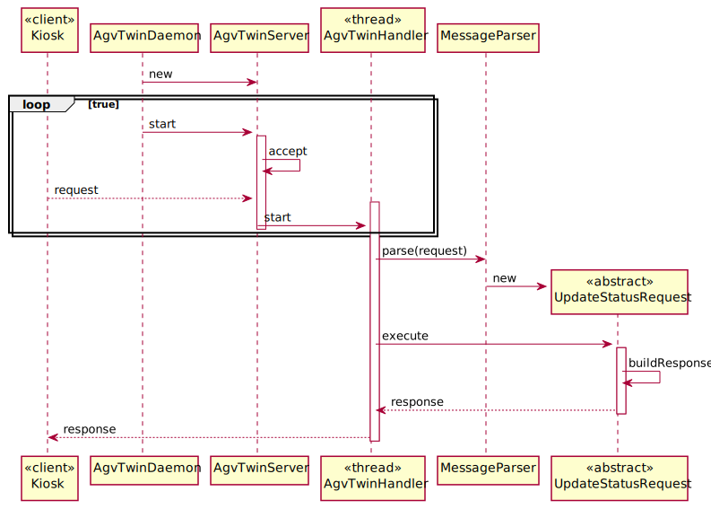

# US5002 - Development of the output communication module of the AGV digital twin to update its status on the "AGVManager"
=======================================

# 1. Requirements

### User Story Description

* As Project Manager, I want that the team start developing the output communication module of the AGV digital 
twin to update its status on the "AGVManager".

### Client clarifications 

> **Question:**  What type of communication do you want, i.e., what are the communications that you want to have 
> between these two. Like AGV Manager says "Take a product" and AGV Digital Twin says "Taken"? Is it something 
> like that? Or am I confused?
>
> [**Answer:**](https://moodle.isep.ipp.pt/mod/forum/discuss.php?d=16593#p21287) The communication must follow 
> the SPOMS2022 protocol. It is up to you and your team to devise a set of messages fulfilling the business 
> requirements properly.

-

> **Question:** Regarding the USs 1901, 4001, 5001 and 5002, what would you consider its complete state, that is, what
> would be the criterion to define whether or not this US is functional?
>
> [**Answer:**](https://moodle.isep.ipp.pt/mod/forum/discuss.php?d=16437#p21096) For all of those US, the communication 
> between the two involved components must be implemented in accordance with the SPOMS2022. The requests 
> processing can be somehow mocked. For instance, if processing a request implies saving some data to the database, 
> the component can instead write such data to a log (mocking). Latter, on next sprint, the teams implement the 
> interaction to the database. However, it is not advisable mocking everything, namely the components (internal) state. 
> Notice that by mocking you are letting extra effort to the next sprint. 
> Finally, all US must be demonstrable.

### Actor 
*  Project Manager

### Acceptance Criteria 
* It must be used the provided application protocol (SPOMS2022).
  It is suggested the adoptiong of concurrent mechanisms (e.g. threads) and state sharing between these mechanisms.
  In this sprint, for demonstration purposes, it is acceptable to mock processing some of the incoming requests 
to foster some output communication.

# 2. Analysis

* Responsible for receiving/sending information from/to other external components such as the “AGV Manager” (cf. Figure 2). 
For instance, it can receive the warehouse plant, the location of the other AGVs as well as the command to pick-up some product(s). On other
hand, it can send information about its current location, status and so on.
* The SPOMS Protocol (SPOMS) is to be used (it is TCP (Transmission Control Protocol) based, therefore, prior to any actual data exchange, a
  TCP connection must be established).

| SPOMS Application  | SPOMSP Roles |
|:-------------------|:-------------|
| AGV (Digital Twin)	|Server application and client application 	         |

# 3. Design

## Sequence Diagram

