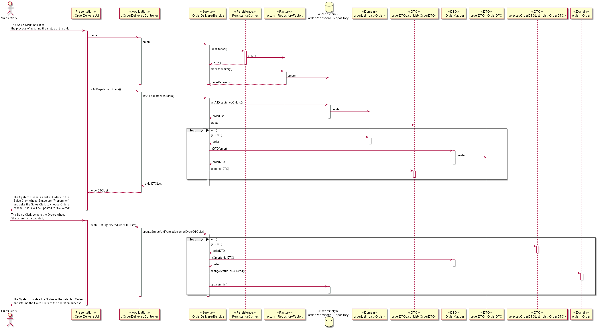

# US1006 - Access a list of orders that had been dispatched for customer delivery and update the status of the order 
============================================================

# 1. Requirements

### User Story Description

* As Sales Clerk, I want to access a list of orders that had been dispatched for customer delivery and be able to update some of those orders to as being delivered. 
 
### Client clarifications

### Actor
*   Sales Clerk

### Acceptance Criteria

* None

# 2. Analysis

# 3. Design

## Sequence Diagram

