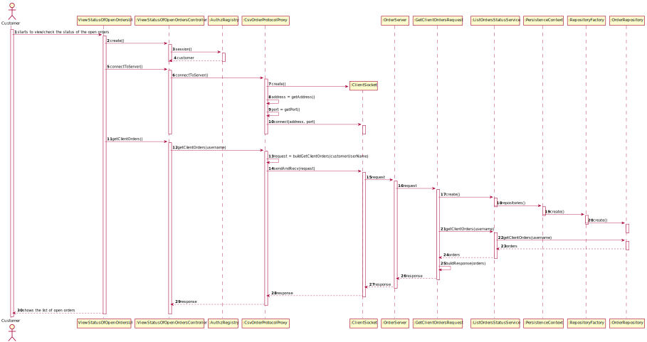
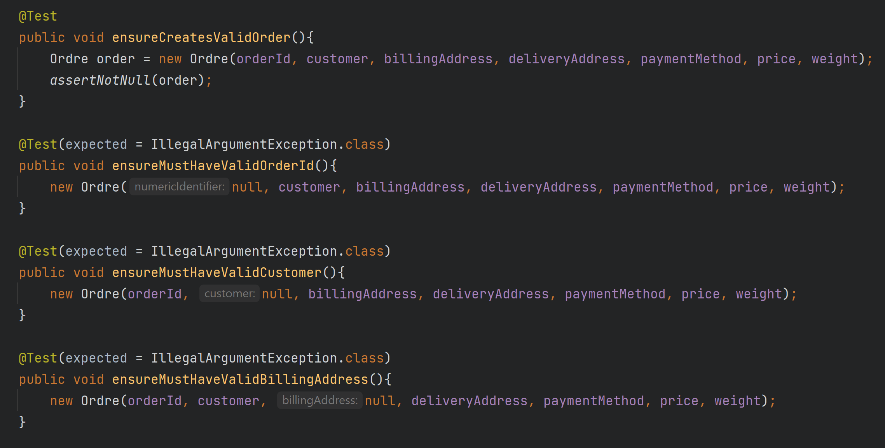
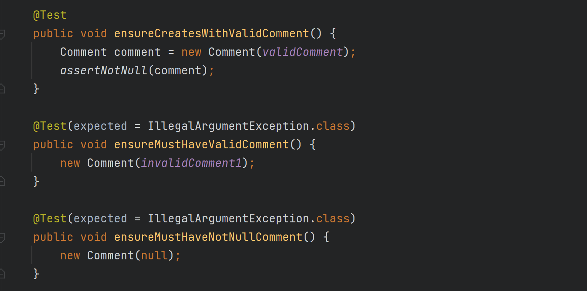
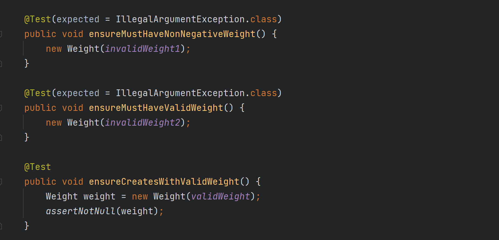

# US1502 - View/check the status of my open orders
=======================================

# 1. Requirements

### User Story Description

* As Customer, I want to view/check the status of my open orders.

### Client clarifications

> **Question:** In the US 1502, it is asked to "view/check the status of my 
> open orders", can you clarify if the open orders are all the orders that have
> been created or if it is orders with a specific status.
>
> [**Answer:**](https://moodle.isep.ipp.pt/mod/forum/discuss.php?d=16984#p21765) It 
> is all orders that have not been delivered to the customer yet.

### Actor 
*  Customer

### Acceptance Criteria 

* It is mandatory using the "OrdersServer" component (cf. US1901).
* It must be used the provided application protocol (SPOMS2022).

# 2. Analysis

- This use case is necessary for the customers that want to view/check the 
  status of their open orders with the Customer Application (it will be running
  in PC of Customers).

- Open orders are all orders that have not been delivered to the customer yet.

- The authentication of the customer is handled directly in the Customer 
  Application.

- The Customer Application is able to communicate using sockets. They will
  implement the connection to this feature.

# 3. Design

This functionality will be provided as a daemon (Order Daemon) with a server socket 
on a well-known address using TCP as transport mechanism. 

* The Customer Application is the client of the Order Daemon.

The application communication protocol used is called SPOMSP 2022.

* It is TCP (Transmission Control Protocol) based, therefore, prior to any actual data exchange, a
TCP connection must be established.

* It uses the client-server model. The client application is the one that takes the initiative of
requesting a TCP connection establishment with the counterpart server application, which
accepts the connection request.

Once a TCP connection is established, the client-server relation persists and only the client
application is allowed to take the initiative of sending data (a request). The server application
must be passively waiting for a request and only then is authorized to send data (a response)
to the received request.
> It will be sent a "GET_CLIENT_ORDERS", «customer», request. 
> 
> The server will reply with a multi-line response in the format: «header» «content-line» (The header is "ORDERS" and 
each content-line will correspond to one open order).

| Server IP    | Server Port |
|:-------------|:----------- |
| 192.168.56.1 |8880         |

## Sequence Diagram

# 4. Tests

### Some examples of tests for the Order class:

### Some examples of tests for the Value Objects of the Order class:

