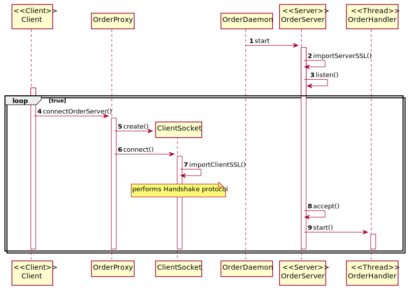

# US1902 - Do the communications through the SPOMS2022 protocol to be secured/protected
=======================================

# 1. Requirements

### User Story Description

* As Project Manager, I want the communications made through the SPOMS2022 protocol to be secured/protected.

### Client clarifications

n/a

### Actor

*  Project Manager

### Acceptance Criteria

* It must be used the provided application protocol (SPOMS2022).
* It should be adopted SSL/TLS with mutual authentication based on public key certificates.
* It complements the US1901.
* Communication is TCP based.
* A truststore is also required to enforce the SSL.

### Relevant business aspects

* To make the communications safe both server and client must have authentication, privacy, and integrity.
* SSL/TLS is a protocol used to ensure the three aspects referred above.
* Authentication means attackers cannot impersonate a licit application.
* Privacy means attackers cannot read the content of data sent between server and client.
* Integrity means attackers cannot change the content of data sent between server and client.

# 2. Analysis

* To implement SSL protocol both server and client must use SSL Sockets.
* A Keystore is required to store certificates with public keys. Used to authenticate its owner side.
* A Truststore is required to certificate the public key. Used to authenticate the other side.

# 3. Design

## Sequence Diagram

