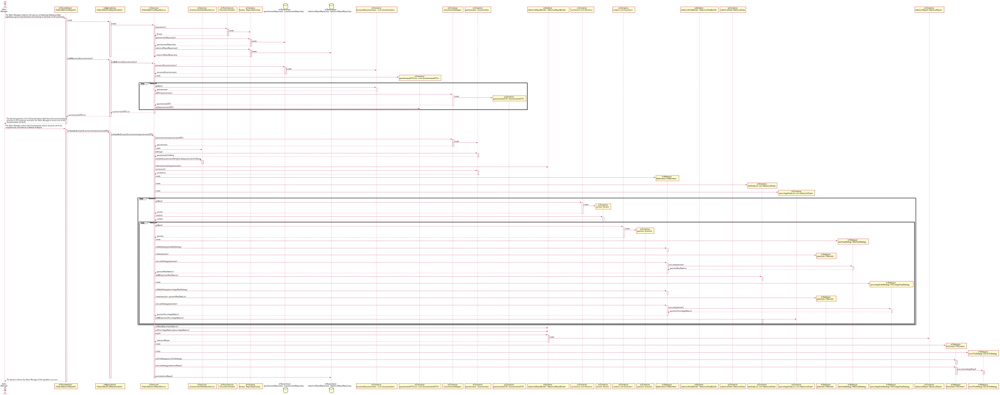

## <b>US 3002 - Obtain Statistical Report regarding a Questionnaire</b>
 

### <b>1. Requirements Engineering</b>
 

#### <b>1.A. Complete Format</b>
 

<b>Main Actor</b>

&ensp;&ensp;&ensp;&ensp;Sales Manager

 

<b>Interested Actors and their respective interests</b>

&ensp;&ensp;&ensp;&ensp;<b>Sales Manager:</b> intends to obtain Statistical Data regarding a given Questionnaire.

&ensp;&ensp;&ensp;&ensp;<b>SPOMS:</b> intends to have statiscal data regarding a given Questionnaire in order to analyze and obtain a greater perception of consumption trends.

 

<b>Preconditions</b>

&ensp;&ensp;&ensp;&ensp;It is required that at least a single Questionnaire be avalaible in the System and answered by a minimum of 30 Customers.

 

<b>Postconditions</b>

&ensp;&ensp;&ensp;&ensp;The Statistical Data regarding a given Questionnaire is compiled and stored in generated Excel file.

 

<b>Main Scenario</b>
<ol>
    <li>The Sales Manager initializes the process of obtaining Statistical Data regarding a given Questionnaire answered by a minimum of 30 Customers;</li>
    <li>The System presents a list of Questionnaires that have been answered by a minimun of 30 Customers and asks the Sales Manager to select one of the Questionnaires at hand;</li>
    <li>The Sales Manager selects the Questionnaire whose answers are to be compiled and converted to a Statistical Report;</li>
    <li>The System validates all the answers given by the Customers related to the selected Questionnaire;</li>
    <li>The System compiles all the validated answers into Statistical Data and converts said Data into a Statistical Report;</li>
    <li>The System informs the Sales Manager of the operation success;</li>
</ol>
 

<b>Alternative Scenarios</b>

&ensp;&ensp;&ensp;&ensp;*a. The Sales Manager cancels the process of compiling a Statistical Report for a given Questionnaire;

> 
&ensp;&ensp;&ensp;&ensp;&ensp;&ensp;&ensp;&ensp;The Use Case terminates;

 

&ensp;&ensp;&ensp;&ensp;2.a. The System doesn't recover any Questionnaire that has been answered by at minumum of 30 Customers;

> 
&ensp;&ensp;&ensp;&ensp;&ensp;&ensp;&ensp;&ensp;The Use Case terminates;

 

&ensp;&ensp;&ensp;&ensp;3.a. The Sales Manager doesn't select any of the previously presented Questionnaires;

> 
&ensp;&ensp;&ensp;&ensp;&ensp;&ensp;&ensp;&ensp;The Use Case terminates;

 

&ensp;&ensp;&ensp;&ensp;4.a. The System detects that a given Answer for a given Question is invalid;

> 
&ensp;&ensp;&ensp;&ensp;&ensp;&ensp;&ensp;&ensp;1. The System considers the Answer as an Invalid Answer for Statistical purpose;

> 
&ensp;&ensp;&ensp;&ensp;&ensp;&ensp;&ensp;&ensp;2. The System continues the validation of the remaining Answers related to the selected Questionnaire;

 

<b>Special Requirements</b>

&ensp;&ensp;&ensp;&ensp;Statistical Report is required to be presented in a Excel file;

 

<b>List of Variations of Technology and Data</b>

&ensp;&ensp;&ensp;&ensp;1. Apache POI - Required to generate Statistical Report Excel file;

&ensp;&ensp;&ensp;&ensp;2. ANTLR - Used for the generation of the required Parser;

 

<b>Frequency of Occurence</b>

&ensp;&ensp;&ensp;&ensp;N/A

 

### <b>2. Design</b>
 

#### <b>2.A. Rationale</b>
 

| Main Scenario | 
Question: Which class...
 | 
Answer
 | 
Pattern - Justification
 |
|:--------------:|:-------------------------:|:-------:|:--------------:|
| 1.&ensp;&ensp;The Sales Manager initializes the process of obtaining Statistical Data regarding a given Questionnaire answered by a minimum of 30 Customers; | 
A. Interacts with the Sales Manager?

B. Coordinates the Use Case?

C. Interacts with the Domain Layer?
 | 
A. ObtainStatisticalReportUI

B. ObtainStatisticalReportController

C. ObtainStatisticalReportService
 | 
A. Pure Fabrication - Class that doesn't represent a concept captured in the Domain Model but is necessary to achieve low coupling and high cohesion;

B. Controller - Class responsible for receiving or handling System events;

C. Controller-Service - Class responsible for processing business logic;
 |
| 2.&ensp;&ensp;The System presents a list of Questionnaires that have been answered by a minimun of 30 Customers and asks the Sales Manager to select one of the Questionnaires at hand; | 
A. Knows how many Customers answered a given Questionnaire?

B. Retrieves Questionnaire instances that have been answered by at least 30 Customers?

C. Creates an instance of QuestionnaireRepository?

D. Manages instance of RepositoryFactory?

E. Contains data related to an instance of Questionnaire and is useable by the Application and Domain Layer?

F. Converts an instance of Questionnaire to an instance of QuestionnaireDTO?
 | 
A. TargetAudience

B. QuestionnaireRepository

C. RepositoryFactory

D. PersistenceContext

E. QuestionnaireDTO

F. QuestionnaireMapper
 | 
A. Information Expert  - Class that has the information necessary to fulfill the responsibility;

B. Repository - Abstraction of the Data Layer which centralises the handling of the Domain Objects;

C. Abstract Factory - Interface responsible for creating a Factory of related Objects without explicitly specifying the intend Class;

D. Information Expert  - Class that has the information necessary to fulfill the responsibility;

E. DTO - Class that encapsulates and aggregates for transfer;

F. DTO - Class responsible of mapping data from Domain Entities to DTOs;
 |
| 3.&ensp;&ensp;The Sales Manager selects the Questionnaire whose answers are to be compiled and converted to a Statistical Report; | | | |
| 4.&ensp;&ensp;The System validates all the Answers given by the Customers related to the selected Questionnaire; | 
A. Knows the Answers to each Question associated to the Questionnaire at hand?

B. Knows which Section a given Question belongs to?

C. Knows which Sections a given Questionnaire is organized by?

D. Valides each Answer relative to a given Question?
 | 
A. Question

B. Section

C. Questionnaire

D. QuestionnaireValidationService
 | 
A. Information Expert  - Class that has the information necessary to fulfill the responsibility;

B. Information Expert  - Class that has the information necessary to fulfill the responsibility;

C. Information Expert  - Class that has the information necessary to fulfill the responsibility;

D. Controller-Service - Class responsible for processing business logic;
 |
| 5.&ensp;&ensp;The System compiles all the validated answers into Statistical Data and converts said Data into a Statistical Report; | 
A. Compiles each validated Answer relative go a given Question, into Data?

B. Compiles all the Raw Data associated to a given Question into Statistical Data?

C. Compiles all Percentages associated to a given Question into Statistical Data?

D. Knows the Parameters required by the previous stated Strategies

E. Knows the Statistical Data relative to the previously selected Questionnaire?
F. Creates instances of StatisticalReport?

G. Converts instance of Statistical Report into a File?

H. Converts instance of Statistical Report into a Excel File?
 | 
A. DataStrategy

B. RawDataStrategy

C. PercentageDataStrategy

D. Parameter

E. StatisticalReport

F. StatiscalReportBuilder

G. FileStrategy

H. ExcelFileStrategy
 | 
A. Strategy - Behavioral Software Design Pattern that enables the selection of an Algorithm at Runtime. During Runtime the Process receives instructions as to which specific implementation of the Algorithm to use;

B. Strategy - Behavioral Software Design Pattern that enables the selection of an Algorithm at Runtime. During Runtime the Process receives instructions as to which specific implementation of the Algorithm to use; 

C. Strategy - Behavioral Software Design Pattern that enables the selection of an Algorithm at Runtime. During Runtime the Process receives instructions as to which specific implementation of the Algorithm to use;

D. Strategy - Behavioral Software Design Pattern that enables the selection of an Algorithm at Runtime. During Runtime the Process receives instructions as to which specific implementation of the Algorithm to use;

E. Information Expert - Class that has the information necessary to fulfill the responsibility;

F. Builder - Creational Design Pattern which allows the construction of an Instance of a given complex Object iteratively;

G. Strategy - Behavioral Software Design Pattern that enables the selection of an Algorithm at Runtime. During Runtime the Process receives instructions as to which specific implementation of the Algorithm to use;

H. Strategy - Behavioral Software Design Pattern that enables the selection of an Algorithm at Runtime. During Runtime the Process receives instructions as to which specific implementation of the Algorithm to use;
 |
 

#### <b>2.B. Systematization</b>
 

From the Rationale, the following Conceptual Classes are promoted to Software Classes:

<ul>
    <li>TargetAudience;</li>
    <li>Question;</li>
    <li>Section;</li>
    <li>Questionnaire;</li>
    <li>StatisticalReport;</li>
</ul>
 

Other Software Classes identified:

<ul>
    <li>ObtainStatisticalReportUI;</li>
    <li>ObtainStatisticalReportController;</li>
    <li>ObtainStatisticalReportService;</li>
    <li>QuestionnaireValidationService;</li>
    <li>PersistenceContext;</li>
    <li>RepositoryFactory;</li>
    <li>QuestionnaireRepository;</li>
    <li>StatisticalReportRepository;</li>
    <li>QuestionnaireDTO;</li>
    <li>QuestionnaireMapper;</li>
    <li>DataContext;</li>
    <li>RawDataStrategy;</li>
    <li>PercentageDataStrategy;</li>
    <li>Parameter;</li>
    <li>StatisticalDataBuilder;</li>
    <li>StatisticalReportBuilder;</li>
    <li>FileContext;</li>
    <li>ExcelFileStrategy;</li>
</ul>
 

#### <b>2.C. Sequence Diagram</b>
 

 
 

#### <b>2.D. Test Planning</b>
 

This section contains primary Unit Tests developped in order to affer the satisfaction of the User Stories requisites;

 

| Tested Class | Test Objective | 
Implementation
                                                                                                                                                                                                             |
|:--------------|:-------------------------|:----------------------------------------------------------------------------------------------------------------------------------------------------------------------------------------------------------------------------------------------------------|
| QuestionnaireRepository | Verify that the method "getAnsweredQuestionnaireIdentifiers()" retrieves the full list of of appropriate Questionnaire Identifiers that have been answered by at least 30 Customers; | 
@Test public void ensureRetrievalOfAnsweredQuestionnaires() { &ensp;&ensp;List\<Questionnaires> expectedResult = questionnaireList;  &ensp;&ensp;assertEquals(expectedResult, questionnaireRepository.answeredQuestionnaires()); } |
| QuestionnaireRepository  | Verify that the method "getAnsweredQuestionnaireIdentifiers()" returns an empty list of Identifiers if no Questionnaire have been answered by at least 30 Customer; | 
@Test public void ensureRetrievalOfEmptyList() { &ensp;&ensp;List\<Questionnaire> expectedResult = new ArrayList<>();  &ensp;&ensp;assertEquals(expectedResult, questionnaireRepository.answeredQuestionnaires()); }               |
| ObtainStatisticalReportService | Verify that the method "listAllAnsweredQuestionnaire()" returns the full list of appropriate QuestionnaireDTOs who have been answered by at least 30 Customers; | 
@Test public void ensureRetrievalOfAnsweredQuestionnaires() { &ensp;&ensp;List\<QuestionnaireDTO> expectedResult = questionnaireDTOList;  &ensp;&ensp;assertEquals(expectedResult, service.listAllAnsweredQuestionnaire()); }      |
| ObtainStatisticalReportService | Verify that the method "listAllAnsweredQuestionnaire()" returns an empty list of Identifiers if no Questionnaire have been answered by at least 30 Customer; | 
@Test public void ensureRetrievalOfEmptyList() { &ensp;&ensp;List\<Questionnaire> expectedResult = new ArrayList<>();  &ensp;&ensp;assertEquals(expectedResult, service.listAllAnsweredQuestionnaire()); }                         |
| RawDataStrategy | Verify that the method "execute(Parameter parameter)" generates mathematically correct data and returns List of Instances of StatisticalData containning said data; | 
@Test public void ensureValidInstantiationOfStatisticalData() { &ensp;&ensp;List<StatisticalData> expectedResult = targetStatisticalData;  &ensp;&ensp;assertEquals(expectedResult, rawDataStrategy.execute(parameter); }          |
| ExcelFileStrategy | Verify that the method "execute(StatisticalReport statisticalReport)" generates an Excel file containning all Statistical Data present in the Instance of StatisticalReport passed as Parameter; | 
@Test public void ensureRetrievalOfAnsweredQuestionnaires() { &ensp;&ensp;excelFileStrategy.execute(statisticalReport);  &ensp;&ensp;assertTrue(Files.exists(targetPath)); }                                                       |
| ExcelFileStrategy | Verify that the method "generateExcelFile(StatisticalReport statisticalReport)" throws an Exception when an invalid Instante of StatisticalReport is passed as Parameter; | 
@Test public void ensureRetrievalOfAnsweredQuestionnaires() { &ensp;&ensp;assertThrows(Exception.class, () -> excelFileStrategy.execute(invalidStatisticalReport)); }                                                                      |
| ObtainStatisticalReportService | Verify that the method "validateAndCompileQuestionnaire(QuestionnaireDTO questionnaireDTO)" compiles, generates an Excel File containning the Statistical Data compiled and persists newly created Instance of StatisticalReport; | 
@Test public void ensureStatisticalReportPersistence() { }                                                                                                                                                                                     |