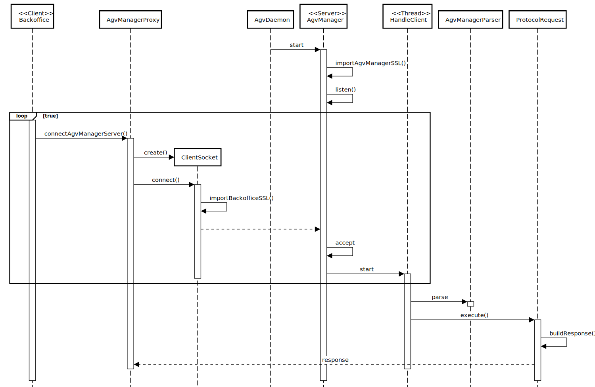

# US4003: AGVManager communications are secured/protected.
=======================================

# 1. Requirements

**US4003**: 
As Project Manager, I want the communications (of the AGVManager) made through the SPOMS2022 protocol to be secured/protected.

# 2. Analysis

# 1.Actor #
* Project Manager.

# 2.Acceptance Criteria #
* It must be used the provided application protocol (SPOMS2022).
* It should be adopted SSL/TLS with mutual authentication based on public key certificates.
* Communication is TCP based.
* Both Server and Client will have a keystore.
* A truststore is also required to enforce the SSL.

# 3.Client Clarifications
* Q1: On the SPOMS Communications Protocol document, it says that an AGVDigitalTwin is both a server and client application. Since it communicates with the AGVManager, does it mean that the AGV Manager is both client and server as well, or should the requests to the Digital Twin be sent as server?
* A1: The AGV Manager is both: server and client. As a server, it receives requests from the "BackOffice App" and from the "Digital Twin" and, as client, it sends requests to the "Digital Twin".

* Q2: On this question (https://moodle.isep.ipp.pt/mod/forum/discuss.php?d=16394) regarding the relationship between US2003 and 4002, you said “However, if such option is not available (e.g.: turned off) or by some reason an order needs to be prepared faster than it would normally be, the warehouse employee has the ability to assign tasks manually (US 2003)”. When you say that the option is turned off, do you mean the AGV Manager as a whole, or just the FIFO algorithm? 
* A2: No! The "turned off" means that the algorithm automatically assigning tasks to AGV is not running. But, the "AGV Manager" stills running.

* Q3: In case it’s just the option that needs to be turned off, if the warehouse employee wants to force a task onto an AGV, does it need to be through the AGV Manager? And can the BackOffice application get the available AGVs directly with the database, or should it ask the AGVManager for them?
* A3: Your solution must be in conformity with figure 2 of the specifications' document.

* Q4: Also, currently, once we start the AGV Manager server, messages are constantly printed on the console, which makes the usability impossible to turn on or off the FIFO option (in case such does exist). Would you prefer having two instances of the app running, one that acts as a server and other that serves as the FIFO, that can be turned on or off?
* A4: You can turn on/off the FIFO algorithm when starting the AGVManager.

* Q5: In case that option does not exist, or the manual task assignment is not done through the AGV Manager, how should the digital twin be aware of the newly created task?
* A5: Currently, there are two options: (i) manually or (ii) automatically by the FIFO algorithm. 

# 4.Relevant business aspects
* To make the communications safe both server and client must have authentication, privacy, and integrity.
* SSL/TLS is a protocol used to ensure the three aspects refered above.
* Authentication means attackers cannot impersonate a licit application.
* Privacy means attackers cannot read the content of data sent between server and client.
* Integrity means attackers cannot change the content of data sent between server and client.

# 5.Requirements
* To implement SSL protocol both server and client must use SSL Sockets.
* A Keystore is rerquired to store certificates with public keys. Used to authenticate its owner side.
* A Truststore is required to certificate the public key. Used to authenticate the other side.

# 6.Process Concept
* The aim is to implement a SSL Handshake, which is basically when both Client and Server
can trust eachother for data transferences. They must authenticate each other before said data is transfered.
* When the AGVManager recieves a resquest it will search its Keystore, 
sending its public key certificate to the Client, asking it to also show its public key.
* Since mutual authentication is required, the Client will also
search its own Keystore, sending the public key the server asked for.
* Once both sides have presented their prublic keyes, they will use the Truststore
to validate each others keyes.
* If one of the sides cannot validate the key with the Trustore the HandshakeProcess will fail.

# 7.Validation Tests
* Test if a client without the correct Keystore can communicate with the AGVManager.
* Test if the AGVManager can send a response to a client that is not authenticated within the Truststore.

# 3. Design

## 3.1. System Diagram

