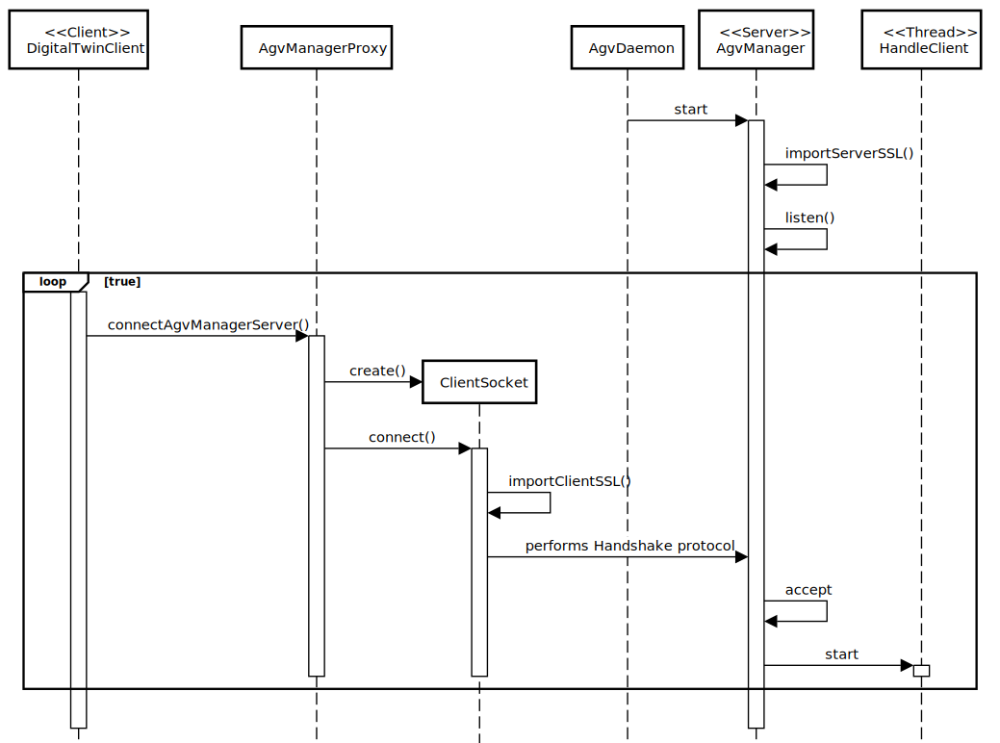

# US5004: AGV Digital Twin output communications are secured/protected.
=======================================

# 1. Requirements

**US5004**: 
As Project Manager, I want the output communications  (of the AGV Digital Twin) made through the SPOMS2022 protocol to be secured/protected.

# 2. Analysis

# 1.Actor #
* Project Manager.

# 2.Acceptance Criteria #
* It must be used the provided application protocol (SPOMS2022).
* It should be adopted SSL/TLS with mutual authentication based on public key certificates.
* Communication is TCP based.
* Both Server and Client will have a keystore.
* A truststore is also required to enforce the SSL.

# 3.Client Clarifications

# 4.Relevant business aspects
* To make the communications safe both server and client must have authentication, privacy, and integrity.
* SSL/TLS is a protocol used to ensure the three aspects refered above.
* Authentication means attackers cannot impersonate a licit application.
* Privacy means attackers cannot read the content of data sent between server and client.
* Integrity means attackers cannot change the content of data sent between server and client.

# 5.Requirements
* To implement SSL protocol both server and client must use SSL Sockets.
* A Keystore is rerquired to store certificates with public keys. Used to authenticate its owner side.
* A Truststore is required to certificate the public key. Used to authenticate the other side.

# 6.Process Concept
* The aim is to implement a SSL Handshake, which is basically when both Client and Server
can trust eachother for data transferences. They must authenticate each other before said data is transfered.
* When the AgvManager recieves a resquest it will search its Keystore, 
sending its public key certificate to the DigitalTwinClient, asking it to also show its public key.
* Since mutual authentication is required, the DigitalTwinClient will also
search its own Keystore, sending the public key the server asked for.
* Once both sides have presented their prublic keyes, they will use the Truststore
to validate each others keyes.
* If one of the sides cannot validate the key with the Trustore the HandshakeProcess will fail.

# 7.Validation Tests
* Test if a DigitalTwinClient without the correct Keystore can communicate with the AgvManager.
* Test if the AgvManager can send a response to a DigitalTwinClient that is not authenticated within the Truststore.

# 3. Design

## 3.1. System Diagram

